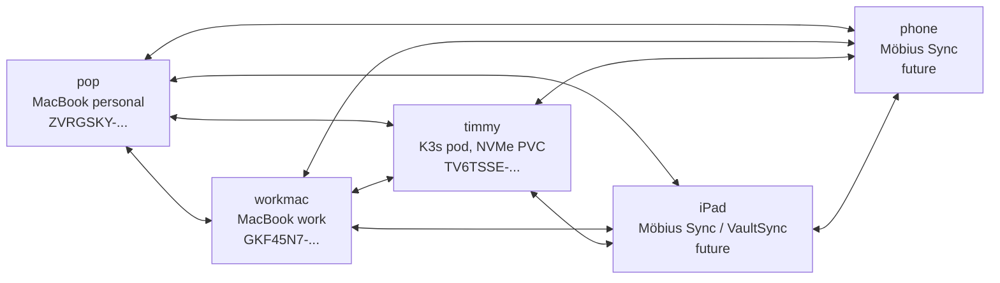

# Syncthing mesh architecture — vault sync across MacBook(s), iPad, phone, and homelab

Date: 2026-06-25

Status: Initial deployment live. Architecture decisions ratified; current state mid-recovery from a `.stignore`-after-initial-sync stalemate (see [Lessons](#lessons-learned-and-followups)). Design rationale lives in compendium **IDEA-1024** (homelab sync infra) and **IDEA-1046** (personal notes/task/memory OS), consolidated under **PROJ-1011**.

---

## Executive summary

A peer-to-peer Syncthing mesh syncs the compendium (and future Obsidian) vaults across every device the user reads or edits notes from — pop (personal MacBook), workmac (work MacBook), and eventually iPad and phone — with **timmy** (a K3s pod backed by a Longhorn NVMe PVC) as an always-on anchor that gives the mesh 24/7 availability, a relay-of-last-resort for two off-LAN peers, and a Longhorn snapshot rollback story that no portable peer can provide.

The choice is deliberately Syncthing over Obsidian Sync, iCloud, or Git-only:

| Option | Why not |
|---|---|
| Obsidian Sync | Paid, limited file size and version history, doesn't integrate with cluster |
| iCloud Drive | Work MacBook cannot sync via iCloud — ruled out |
| Git only | Cumbersome for phone/iPad capture and conflict resolution; commits as workflow step rather than continuous sync |
| Direct Longhorn-mounted Obsidian vault | Rejected in IDEA-1020 — Obsidian doesn't tolerate network-mount latency / watcher edge cases |

Syncthing wins because every peer keeps a local-filesystem copy (Obsidian sees ordinary files), changes converge automatically (no cron, no human action), Tailscale gives stable cross-network identity, and the cluster-side replica unlocks both an always-on convergence point and Longhorn-snapshot recovery.

---

## Topology

Syncthing is fully peer-to-peer. There is no central node. **timmy is not a server.** It's a peer that's always on; that's its only special property.



Pair every device with every other device — a full mesh. Syncthing's gossip handles deduplication; if pop already has a chunk timmy is offering, workmac picks whichever lands first. The marginal cost of pairing is essentially zero.

### Why every peer pairs with every other peer

| Topology | Failure case |
|---|---|
| Star (workmac ↔ timmy only) | timmy offline → workmac and pop can't sync, stuck waiting |
| Mesh (all pairs) | Any peer can be offline and the remaining peers keep converging directly |

---

## Device identity model

The user thinks about peers in two namespaces, not Syncthing's cryptographic device IDs:

| Layer | What's actually used |
|---|---|
| Routable identity | **Tailscale hostnames** (`pop`, `workmac`, `timmy`, `ipad`, `phone`) — stable across networks |
| Cluster identity | **K3s node names** (`timmy`, `wemby`, `manu`) for the cluster-side peer |
| Pairing identity | **Syncthing device IDs** — used only at first pairing, then forgotten about |

Device IDs as of 2026-06-25 (these are public-key fingerprints; pairing requires both sides to accept, so publishing them isn't a credential leak):

| Peer | Device ID |
|---|---|
| pop | `ZVRGSKY-S5IWVAO-KGLSP7P-HEG2JQD-DSLVKYY-QBUQ7RE-5AOKW62-PBZJRAW` |
| timmy | `TV6TSSE-KGK7I5I-67NHCFE-5W2UWHK-5MSILTH-DANAGXN-SXFX5IF-JOV37AU` |
| workmac | `GKF45N7-TQAOMY5-AJN2RCK-EA454OI-X5ZINSB-L7RVON4-QBCJAP3-U467NAG` |

---

## Folder roles (per peer, per folder)

For the `compendium` folder:

| Peer | Role | Reasoning |
|---|---|---|
| pop | `sendreceive` | Primary editing surface |
| workmac | `sendreceive` (or `receiveonly` if locked-down preferred) | Editing flexibility from work; receive-only would eliminate workmac as a source of conflicts |
| timmy | `receiveonly` (planned, flip pending) | Pure cluster-side replica + snapshot target; cluster-internal writes (Hermes, kubectl exec) get quarantined rather than propagating |
| iPad / phone | `sendreceive` (typical) or `receiveonly` (if pure consumption) | TBD per device |

`receiveonly` on timmy is the architectural pick because timmy is the anchor, not an editor. Cluster-internal writes shouldn't propagate to user devices without an explicit override — receive-only mode makes that the default-safe behavior.

### What's NOT being used

- **`receiveencrypted`** — overkill. timmy is trusted infrastructure; we want the cluster-side replica to be legible so Hermes or other in-cluster tools can read it if useful later.
- **Versioning replacement** — Syncthing's per-folder File Versioning (Staggered) is the first line of defense; daily Longhorn snapshots on the timmy PVC are the backstop.

---

## Network paths

Sync protocol port 22000 (both TCP and QUIC). Each device has multiple addresses for the cluster anchor depending on where it sits:

| From | Address | When this works |
|---|---|---|
| LAN-connected device | `tcp://192.168.1.19:32200` | On the home LAN (K3s LB IP) |
| Off-LAN device on tailnet | `tcp://100.95.215.105:32200` | timmy's tailnet IP — direct path |
| Either, preferred | `quic://192.168.1.19:32200`, `quic://100.95.215.105:32200` | QUIC over either path, lower latency |
| Fallback | `dynamic` | Global discovery + Syncthing relays if explicit addresses fail |

NodePort assignments on the cluster anchor:

| Port | NodePort | Protocol | Purpose |
|---|---|---|---|
| 8384 | (none — ClusterIP `syncthing-gui` only) | TCP | GUI / REST API; reach via `kubectl port-forward svc/syncthing-gui 8384:80` |
| 22000 | 32200 | TCP + UDP | Sync protocol |
| 21027 | 32127 | UDP | Local discovery broadcast (LAN-only utility) |

GUI is intentionally ClusterIP-only on first deploy. Off-cluster GUI access is a deferred follow-up (Tailscale NodePort with ip-allowlist, or Cloudflare-Access-gated Ingress).

---

## Cluster-side workload

| Piece | Detail |
|---|---|
| Namespace | `syncthing` |
| Workload | Single Deployment, `Recreate` strategy, replicas=1 |
| Image | `docker.io/syncthing/syncthing:1.27.12` (TODO: digest-pin before next deploy) |
| Pod node pin | `kubernetes.io/hostname: timmy` — colocates pod with the Longhorn replica on timmy's NVMe |
| Storage | PVC `syncthing-data`, 50 Gi `longhorn-nvme`, single replica |
| Snapshot policy | `syncthing-data-snap-daily` Longhorn RecurringJob @ 04:30, 7-day retention |
| Container UID | 1000 (matches the official image; non-root) |
| GUI auth | username/password persisted in `/var/syncthing/config/config.xml` (bcrypt-hashed) |
| Cluster device ID origin | `/var/syncthing/config/{cert.pem,key.pem}` — generated on first start, persists across restarts via PVC |

### Why timmy specifically

Per HARDWARE.md, the three nodes' NVMe capacity:

| Node | NVMe disks |
|---|---|
| timmy | WD Green SN3000 2 TB |
| manu | (no nvme-tagged disk) |
| wemby | WDC PC SN520 256 GB |

`longhorn-nvme` uses `diskSelector: nvme`, so only timmy and wemby are candidates. timmy was chosen for headroom (2 TB vs 256 GB) and because the live `longhorn-nvme` allocator placed the replica there. The pod's `nodeSelector` keeps the engine on the same node as the replica.

### Storage tradeoff

`longhorn-nvme` is single-replica (`numberOfReplicas: "1"`). For Syncthing that's acceptable because every paired peer already holds a full copy of the vault — the cluster anchor is one of N copies, not the only copy. The Longhorn snapshot is the local backstop; an off-cluster mirror (Longhorn → Garage S3) is a deferred follow-up matching the copyparty pattern.

---

## Ignore patterns

A single `.stignore` file at the vault root is the source of truth. It lives in the folder, replicates to every peer, and Syncthing applies it automatically on scan — no per-device GUI configuration needed.

The current `~/code/compendium/.stignore` excludes:

| Category | Patterns |
|---|---|
| VCS plumbing | `.git`, `.gitignore`, `.worktrees`, `.pre-commit-config.yaml` |
| OS junk | `.DS_Store`, `Thumbs.db`, `desktop.ini` |
| Obsidian per-device state | `.obsidian` (whole directory) |
| Local dev artifacts | `.venv`, `__pycache__`, `*.pyc`, `.ruff_cache`, `.mypy_cache`, `node_modules`, `*.egg-info` |
| Toolchain config (managed via git) | `.markdownlint-cli2.jsonc`, `.markdownlintignore`, `.prettierrc` |
| Claude Code project state | `.claude` |
| Old lifecycle artifacts | `*.bak`, `*.swp`, `*.tmp`, `*~` |
| Syncthing internals | `.stversions`, `.stfolder`, `*.sync-conflict-*` |

### Notable decision: the entire `.obsidian/` directory is excluded

Workspace, cache, plugin state, installed-plugin lists, themes, and per-vault settings all stay per-device. Tradeoff: setting up a new peer means installing the desired plugins and configuring Obsidian on that peer separately — sync only handles vault content, not Obsidian itself. Worth it because partial `.obsidian/` syncing (just `workspace*` + `cache` + `plugins/*/data.json`) had every device fighting over the same "what's open" state and plugin data files containing absolute paths.

### Notable decision: `.git/` is excluded

Commits are made on pop (the primary editing surface). iPad/phone/workmac are read or light-edit surfaces and don't need git history locally. Excluding `.git/` keeps sync cheap (no thousands of small object files) and avoids the occasional `git gc` weirdness during transfer.

The implication: when a peer (e.g., workmac) writes a change, the user manually pulls or pushes on pop to commit it. Sync is for content propagation; git is for review history. The two are separate.

---

## Operational runbook

### Adding a new peer

1. Install Syncthing on the new device (`brew install syncthing` on macOS; Möbius Sync / VaultSync on iOS).
2. Grab the new peer's device ID (Actions → Show ID in its GUI).
3. On **every** existing peer's GUI: Add Remote Device → paste the new peer's ID, name it, tick `compendium` under Sharing. Save.
4. On the **new peer**: pairing requests appear from each existing peer → accept → set Device Name + addresses (Tailscale IPs as primary).
5. On the new peer: folder-share request for `compendium` appears → accept → set Folder Path (e.g. `~/code/compendium` on a Mac).
6. Per folder, set File Versioning → Staggered (Advanced tab).

### GUI access (current — ClusterIP only)

```bash
kubectl -n syncthing port-forward svc/syncthing-gui 8384:80
open http://localhost:8384
# user: noot, password: as set in config.xml
```

### Recovery from a sync stalemate

Symptom: timmy logs `Folder isn't making sync progress - retrying in 1m0s` with hundreds of `no connected device has the required version of this file` lines.

Diagnostic API calls (from inside the pod):

```bash
APIKEY=$(kubectl -n syncthing exec deploy/syncthing -- sh -c "grep -oE '<apikey>[^<]+' /var/syncthing/config/config.xml | sed 's/<apikey>//'")
kubectl -n syncthing exec deploy/syncthing -- sh -c "wget -qO- --header='X-API-Key: $APIKEY' http://127.0.0.1:8384/rest/db/status?folder=compendium"
# look at: errors, pullErrors, needFiles, ignorePatterns
```

If `ignorePatterns: false` on timmy, the `.stignore` file didn't reach it (typically because pop is stuck before the file could propagate). Write `.stignore` directly to the cluster-side replica path (`/var/syncthing/compendium/.stignore`), then trigger a rescan via the REST API or GUI.

---

## Lessons learned and followups

### Lesson: write `.stignore` BEFORE first share, not after

The current stalemate happened because `.stignore` was created after pop had already indexed `.git/` and `.venv/` and started pushing them. Once `.stignore` landed, pop refused to send the ignored files, but timmy's index still expected them — hundreds of pull errors, no forward progress.

The fix in this case is a one-time cleanup (described above). The lesson for future folders: put `.stignore` in place before adding the folder to Syncthing.

### Open followups (not blocking)

| Item | Notes |
|---|---|
| Flip `compendium` folder on timmy to `Receive Only` | The architectural call; reduces writer count and prevents accidental cluster-side propagation |
| Clean up the current stalemate | Delete `.git/`, `.venv/`, and 12 `.syncthing.*.tmp` conflict files on timmy; leave 6 real content conflicts for manual merge |
| Pair workmac fully | Workmac has been pairing but is currently disconnected; decide on `sendreceive` vs `receiveonly` for workmac |
| Add iPad and phone | Möbius Sync or VaultSync on iOS; first real test of the always-on anchor's value |
| Expose GUI off-cluster | Tailscale NodePort with ip-allowlist OR Cloudflare-Access-gated Ingress; currently GUI is port-forward only |
| Off-cluster snapshot mirror | Longhorn → Garage S3 for the syncthing-data PVC (matches the deferred copyparty follow-up) |
| Digest-pin the Syncthing image | Currently `docker.io/syncthing/syncthing:1.27.12`; switch to `image@sha256:...` to match the copyparty/iv pattern |
| Add `syncthing` to homelab `CLAUDE.md` Service routing table | Keeps the cluster's operational map honest |

---

## References

- Design: `~/code/compendium/ideas/IDEA-1024-other-rsync-cron-for-compendium-and-codebase-sync.md` (homelab sync infra: continuous Syncthing for vaults, scheduled rsync/git for codebases/configs)
- Design: `~/code/compendium/ideas/other/IDEA-1046-other-personal-notes-task-memory-operating-system.md` (personal OS — Obsidian capture + compendium durable layer + Hermes automation + sync options)
- Project: `~/code/compendium/projects/PROJ-1011-other-personal-notes-task-memory-os.md` (consolidates both ideas)
- Manifests: `syncthing/{namespace,data-pvc,syncthing-deployment,snapshot-policy,kustomization}.yaml`
- Service README: `syncthing/README.md`
- Syncthing upstream docs:
  - <https://docs.syncthing.net/intro/getting-started.html>
  - <https://docs.syncthing.net/users/ignoring.html>
  - <https://docs.syncthing.net/users/versioning.html>
  - <https://docs.syncthing.net/users/foldertypes.html>
- Related compendium decisions:
  - IDEA-1020 (dropped) — direct Longhorn-mounted Obsidian vault; rejected for network-mount latency / watcher edge cases
