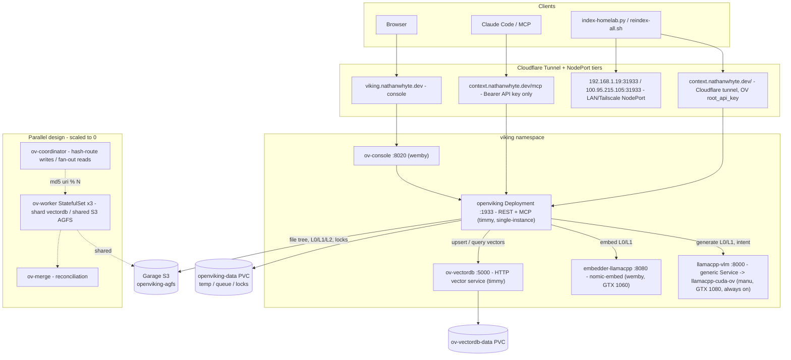

# OpenViking Stack — Implementation Report

_Generated 2026-06-04. Reflects the post-2026-06-03 production cutover state (`agfs:s3` + `vectordb:http`)._

> **⚠️ Dated snapshot** — the following have changed since 2026-06-04:
>
> - OV image upgraded from `v0.3.14` → `v0.4.4` (2026-06-21)
> - Embedder moved from nomic-embed-text-v1.5 on wemby (GTX 1060, CUDA, 768-dim) → Qwen3-Embedding-4B on timmy (RX 9070 XT, ROCm, 2560-dim) (IDEA-1042, 2026-06-22)
> - `embedding.max_input_tokens` raised from 1900 → 8192
> - `vlm.max_concurrent` raised from 2 → 4 (IDEA-1042 Phase 4)
> - `ov-console` still runs `v0.3.14` (console not bumped during the v0.4.4 upgrade)
>
> For current state, see `CLAUDE.md` (service routing, LLM config) and `HARDWARE.md` (node specs).

This document describes how the OpenViking ("OV") stack is implemented in the
homelab K3s cluster: what each component is, how they wire together, how data
flows from ingest to retrieval, the access/auth patterns, and the relevant
internals of OpenViking itself. It is meant to be self-contained — readable
without prior cluster knowledge.

---

## Executive summary

OpenViking is a hierarchical RAG engine that stores knowledge as a
filesystem-shaped tree (`viking://` URIs, "AGFS") with auto-generated semantic
indices layered on top. In the homelab it runs as a **single-instance**
deployment in the `viking` namespace on K3s, reachable at four tiers:
in-cluster `openviking.viking.svc:1933`, LAN NodePort `192.168.1.19:31933`,
Tailscale `100.95.215.105:31933`, and public `context.nathanwhyte.dev`
(Cloudflare tunnel — no Traefik IngressRoutes are live). Console at
`viking.nathanwhyte.dev`.

As of the 2026-06-03 cutover, OV stores its **file tree in S3/Garage**
(`agfs:s3`) and its **embeddings in a dedicated HTTP vector service**
(`vectordb:http` → `ov-vectordb`). This split moved two write-serializing locks
(an embedded-LevelDB process lock and an AGFS subtree lock) to process-local
scope, which is the precondition for the dormant parallel-worker design.

Two GPU-backed model servers do the heavy lifting: a **nomic-embed-text-v1.5
embedder** on wemby's GTX 1060 (CUDA — moved off manu in IDEA-009 Phase 2
to free the GTX 1080 for the VLM), and a **Qwen3-8B VLM** on manu's
GTX 1080 (CUDA, IQ4_XS, ctx=32768, 2 slots — primary VLM since IDEA-009
Phase 3). The retired ROCm VLM on timmy's RX 9070 XT is kept as
rollback-only (Phase 4, 2026-06-06); the freed 16 GB AMD card now
serves Ollama exclusively. A coordinator/worker/merge trio for parallel
indexing is built but scaled to 0.



---

## 1. What OpenViking is

OpenViking (`ghcr.io/volcengine/openviking`, currently `v0.3.14`) is a
hierarchical context/RAG engine. Unlike a flat vector store, it organizes
content as a **filesystem-shaped knowledge tree** (the "AGFS" — Agent
Filesystem) addressed by `viking://` URIs, and layers semantic indices on top
of it. It exposes both a REST API (`/api/v1/*`) and a native **MCP** endpoint
(`/mcp`) so agents like Claude Code can read/write context directly.

### Three content layers (how retrieval actually works)

Every file and every directory in the tree gets three tiers of representation,
most of them auto-generated by a VLM at ingest time:

| Layer  | Name     | File                     | ~Token budget | Role                             |
| ------ | -------- | ------------------------ | ------------- | -------------------------------- |
| **L0** | Abstract | `.abstract.md`           | ~100          | Vector search / coarse filtering |
| **L1** | Overview | `.overview.md`           | ~2,000        | Rerank / navigation              |
| **L2** | Detail   | original file(s)/subdirs | unlimited     | On-demand full content           |

A directory in the AGFS therefore looks like:

```
viking://resources/docs/auth/
├── .abstract.md      # L0
├── .overview.md      # L1
├── .relations.json   # relations table
└── *.md              # L2 raw content
```

### Directory-recursive retrieval algorithm

OV does **not** do flat top-k vector search. `search()` runs:

1. **Intent analysis** — the LLM decomposes the query into 0–5 TypedQueries.
2. **Initial positioning** — vector search over L0 abstracts to find
   high-scoring directories.
3. **Recursive descent** — children scored as
   `final = alpha * embedding_score + (1 - alpha) * parent_score`
   (default `alpha = 0.5`).
4. **Convergence** — stops once top-K stabilizes for 3 rounds.
5. **Rerank** — L1 overviews drive the final ordering.

**Implication:** a well-named, well-abstracted parent directory amplifies all
of its children's scores; a UUID-named directory with no abstract makes its
children effectively invisible. This is why the OV organization guide
(`viking/OPENVIKING.md`) is strict about directory hygiene.

`find()`/`glob()` are filename-pattern tools (e.g. `**/*.md`); `search()` is
content/semantic retrieval. Use the right one.

---

## 2. Storage architecture

OV separates two storage concerns, and each has a pluggable backend:

| Concern      | What it stores                                                 | Backend (prod) | Target                          |
| ------------ | -------------------------------------------------------------- | -------------- | ------------------------------- |
| **AGFS**     | the `viking://` file tree, L0/L1/L2 markdown, relations, locks | `s3`           | Garage bucket `openviking-agfs` |
| **VectorDB** | dense embeddings (768-dim) of L0/L1                            | `http`         | `ov-vectordb` FastAPI service   |

This split is the heart of the 2026-06-03 cutover. Previously both were
`local` (AGFS tree on the PVC, VectorDB as an embedded LevelDB/RocksDB store).
Two separate bottlenecks were serializing writes:

- **Embedded VectorDB lock**: the local store is LevelDB-backed; each uvicorn
  `server.worker` is a _separate process_ and they all tried to open the same
  on-disk `LOCK`. This is why bumping `server.workers > 1` failed historically.
- **AGFS subtree (TREE) lock**: AGFS serializes writes to any subtree via
  `.path.ovlock` files (the transaction protocol scans ancestors + descendants,
  writes a TREE lock at the root, does a TOCTOU re-check, then proceeds). A hot
  subtree like `resources/compendium` became a single-writer chokepoint.

Moving AGFS to S3 (Garage) and VectorDB to a dedicated HTTP service makes both
locks process-local per pod, which is what unlocks real parallel writers.

### S3 (AGFS) config

```json
"agfs": {
  "backend": "s3",
  "s3": {
    "bucket": "openviking-agfs",
    "endpoint": "http://garage.garage.svc.cluster.local:3900",
    "region": "garage",
    "access_key": "${S3_ACCESS_KEY}",
    "secret_key": "${S3_SECRET_KEY}",
    "use_path_style": true
  }
}
```

### HTTP (VectorDB) config

```json
"vectordb": {
  "backend": "http",
  "name": "context",
  "dimension": 768,
  "url": "http://ov-vectordb.viking.svc.cluster.local:5000"
}
```

The `http` backend wraps the same engine OV uses locally, but served over
FastAPI by `ov-vectordb` so it can be shared and locked independently.

---

## 3. Component inventory

All components live in the `viking` namespace. Manifests are in
`viking/manifests/`.

| Component           | Kind        | Node  | Replicas | Role                                                                                                                                                                            | State                 |
| ------------------- | ----------- | ----- | -------- | ------------------------------------------------------------------------------------------------------------------------------------------------------------------------------- | --------------------- |
| `openviking`        | Deployment  | timmy | 1        | Main OV server (REST + MCP), single-instance                                                                                                                                    | **Active**            |
| `ov-vectordb`       | Deployment  | timmy | 1        | HTTP vector service (`vectordb:http` target)                                                                                                                                    | **Active**            |
| `embedder-llamacpp` | Deployment  | wemby | 1        | nomic-embed-text-v1.5 on GTX 1060 (CUDA)                                                                                                                                        | **Active**            |
| `llamacpp-cuda-ov`  | Deployment  | manu  | 1        | Qwen3-8B VLM on GTX 1080 (CUDA, IQ4_XS, ctx=32768, 2 slots) — sole GPU workload on manu, no conflict with CPU-only hermes-agent; **always on since 2026-06-11** (was on-demand) | **Active**            |
| `llamacpp-rocm`     | Deployment  | —     | 0        | Qwen3-8B VLM on RX 9070 XT (ROCm) — **retired 2026-06-06** (IDEA-009 Phase 4); `vlm-pool` label removed; kept for rollback                                                      | Permanently 0         |
| `llamacpp-vlm`      | Service     | —     | —        | Generic VLM Service, selector `vlm-pool: "true"` → routes to `llamacpp-cuda-ov`                                                                                                 | **Active** (selector) |
| `ov-console`        | Deployment  | wemby | 1        | Web UI (`--write-enabled`)                                                                                                                                                      | **Active**            |
| `ov-coordinator`    | Deployment  | —     | 0        | Hash-routing write proxy / read fan-out                                                                                                                                         | Scaled to 0           |
| `ov-merge`          | Deployment  | —     | 0        | Reconciliation service for worker shards                                                                                                                                        | Scaled to 0           |
| `ov-worker`         | StatefulSet | —     | 0        | 3-replica parallel-indexing pool                                                                                                                                                | Scaled to 0           |

The cluster currently runs in **single-instance mode**: one `openviking` pod
does all ingest, queue work, and serving. The coordinator/worker/merge trio is
a built-but-dormant parallel design (see §7).

### 3.1 The `openviking` Deployment (the core)

Pinned to **timmy** via `nodeSelector` (keeps OV's data path co-located with
the `ov-vectordb` service and the Garage S3 endpoint on the same node;
`Recreate` strategy — single writer, no rolling overlap). Four init containers
run before the main container:

1. **`config-rewrite`** (`python:3.12-slim`) — reads the ConfigMap template at
   `/config-template/ov.conf`, injects `server.root_api_key` from the
   `openviking-api-key` secret, and _conditionally_ injects S3
   `access_key`/`secret_key` from `openviking-s3-credentials` **only if**
   `agfs.backend == "s3"` (otherwise strips the `s3` block). Writes the rendered
   config to an `emptyDir` mounted at `/app/.openviking/ov.conf`. This makes the
   manifests backend-agnostic.
2. **`temp-cleanup`** (`busybox`) — deletes stale temp files (>1 day), removes
   `.openviking.pid`, the local vectordb `LOCK`, and stray `.path.ovlock` files
   left by a hard crash.
3. **`patch-syncdiff`** (OV image) — monkey-patches
   `semantic_processor.py` in the venv to wrap `_mv_vector_store_l0_l1` in a
   3-attempt exponential-backoff retry. This tolerates transient lock
   contention when moving L0/L1 indices during semantic processing.

The **main container** serves on port 1933, mounts the rendered config
(read-only) and the `openviking-data` PVC at `/app/data`. Probes: `/health`
(startup), `/ready` (readiness), TCP 1933 (liveness). Resources req 4 CPU /
4Gi, lim 12 CPU / 8Gi.

A sidecar **`lock-cleanup`** (busybox) loops every 300s deleting orphaned
`.path.ovlock` files and empty temp dirs — a janitor for stuck AGFS locks.

### 3.2 `ov-vectordb`

`ghcr.io/volcengine/openviking:v0.3.14` run as
`python -m openviking.storage.vectordb.service.server_fastapi`, pinned to
timmy, serving port 5000. Persists to `/data/vikingdb`
(`VIKINGDB_PERSIST_PATH`) on the `ov-vectordb-data` PVC. `/health` probes, req
1 CPU / 2Gi, lim 4 CPU / 8Gi, `Recreate`.

### 3.3 Models — embedder and VLM

OV calls out to two OpenAI-compatible model servers (both llama.cpp):

- **Embedder** — `embedder-llamacpp` on **wemby**, GTX 1060, `runtimeClassName:
nvidia`. Model `nomic-embed-text-v1.5.f16` (768-dim), `--n-gpu-layers 999`
  (full offload), ctx 16384, `--parallel 2` (8192 tok/slot, matches model's 8192 native limit; was `--parallel 8` until 2026-06-16 — 2048 tok/slot caused overflow), batch/ubatch 4096, mean pooling,
  yarn rope (freq-scale 0.75), `--mlock`. Served at
  `embedder-llamacpp.viking.svc:8080/v1`. **Model cached on the
  `wemby-model-cache` Longhorn PVC** → survives restarts (moved from
  `emptyDir` in IDEA-009 Phase 2 when the embedder migrated off manu).
- **VLM** — `llamacpp-cuda-ov` on **manu**, GTX 1080, Qwen3-8B IQ4_XS, ctx
  32768, `--parallel 2`. Primary VLM since IDEA-009 Phase 3. **Sole GPU
  workload on manu** — hermes-agent and hermes-jump are CPU-only, so scaling
  the VLM up has zero GPU conflict. The standalone
  config points OV at the generic `llamacpp-vlm.viking.svc` Service
  (`provider: litellm`, `model: openai/current.gguf`), which `selector
vlm-pool: "true"` routes to this deployment. Steady-state replicas=1,
  always on (changed 2026-06-11 from the on-demand pattern described
  in earlier revisions — see commit history; the 1080 is VLM-exclusive
  and the round-trip risk of cutting off in-flight L0 jobs isn't worth
  the saved watts). Manual `viking/tools/ov-vlm.sh down` is still
  available to release the GPU for something else, and `up`/`run` exist
  for completeness. The previous ROCm VLM (`llamacpp-rocm` on timmy's
  RX 9070 XT) was retired in
  IDEA-009 Phase 4 — manifest and PVC retained for rollback, but the
  `vlm-pool` label was removed so the unified Service can never route to
  it.

---

## 4. Configuration

Two ConfigMaps, both rendering `/app/.openviking/ov.conf`:

| ConfigMap                      | Used by                 | Purpose                               |
| ------------------------------ | ----------------------- | ------------------------------------- |
| `openviking-standalone-config` | `openviking` Deployment | Canonical single-instance prod config |
| `openviking-config`            | `ov-worker` StatefulSet | Worker config (if scaled up)          |

Key prod values (`openviking-standalone-config`):

| Key                                | Value                             | Note                                                                                                                                                                                                                                                                                           |
| ---------------------------------- | --------------------------------- | ---------------------------------------------------------------------------------------------------------------------------------------------------------------------------------------------------------------------------------------------------------------------------------------------- |
| `storage.agfs.backend`             | `s3`                              | Garage `openviking-agfs`                                                                                                                                                                                                                                                                       |
| `storage.vectordb.backend`         | `http`                            | `ov-vectordb:5000`, dim 768                                                                                                                                                                                                                                                                    |
| `storage.transaction.lock_timeout` | 30.0 s                            | AGFS TREE lock acquisition timeout                                                                                                                                                                                                                                                             |
| `storage.transaction.lock_expire`  | 300.0 s                           | stale-lock expiry                                                                                                                                                                                                                                                                              |
| `server.workers`                   | **2**                             | bumped from 1 on 2026-06-04 (Ollama no longer shares the 9070 XT)                                                                                                                                                                                                                              |
| `server.port`                      | 1933                              |                                                                                                                                                                                                                                                                                                |
| `embedding.dense.model`            | `nomic-embed-text-v1.5`           | via embedder service                                                                                                                                                                                                                                                                           |
| `embedding.dense.batch_size`       | 128                               |                                                                                                                                                                                                                                                                                                |
| `embedding.max_input_tokens`       | **1900**                          | mandatory guardrail — see [OPENVIKING.md §Critical tuning](../OPENVIKING.md). `nomic-embed-text-v1.5` reports `n_ctx: 2048` to llama.cpp regardless of `--ctx-size`; OV only truncates when this is set, so without it long docs overflow the 2048 slot (commit `6830a18`).                    |
| `embedding.max_concurrent`         | **4**                             | bumped from 2 on 2026-06-04 (TASK-010); FEAT-004 proved 4 safe                                                                                                                                                                                                                                 |
| `vlm.provider` / `model`           | `litellm` / `openai/current.gguf` | → `llamacpp-vlm` (generic) → `llamacpp-cuda-ov`                                                                                                                                                                                                                                                |
| `vlm.max_concurrent`               | **2**                             | matches VLM server's `--parallel 2`. Was 4 on 2026-06-04 (TASK-010); reverted to 2 in IDEA-009 Phase 3 (2026-06-06) because the CUDA VLM only has 2 slots and over-commit caused every request to time out at 60s × 3 retries, stalling the queue. Drain rate with 2/2 is ~1 L0/min sustained. |

`server.workers=1` was deliberately conservative for the post-cutover
queue-drain window even though the embedded-LevelDB lock constraint that
originally forced it no longer applies. **Bumped to 2 on 2026-06-04** along
with `vlm.max_concurrent=2` and `embedding.max_concurrent=2` (Ollama is no
longer sharing the 9070 XT, so the prior safety cap is gone). Same day
(2026-06-04, after ~30 min stable at 2/2/2 and the carryover queue had drained
from 217 → 43), `vlm.max_concurrent` and `embedding.max_concurrent` were
bumped to **4**; `server.workers` held at 2 (it's an HTTP request-handling
knob, not a VLM/embedding throughput knob). FEAT-004 had already proved
4-writer parallelism is safe against `agfs:s3`+`vectordb:http` in isolation,
so the bump is matching production to the validated maximum — no new
unknown. Verified: 4 concurrent VLM slot completions observed in
`llamacpp-rocm` logs, queue monitor TICK 17 showed `inprog` jump 2 → 5 and
`pending` drop 43 → 5 in one tick, VLM pod memory stable at 8.8 GB with no
OOM. See `TASK-009` and `TASK-010` in `~/code/archive/personal-compendium/tasks/`.

> **Updated 2026-06-06 (IDEA-009 Phase 3):** the VLM moved to
> `llamacpp-cuda-ov` (GTX 1080, 2 slots, IQ4_XS). `vlm.max_concurrent`
> reverted from 4 → **2** because the new VLM server only has
> `--parallel 2`; 4-on-2-slot over-commit caused every request to time
> out at 60s × 3 retries and stall the queue. Drain rate with
> 2/2/2 (~1 L0/min) is slower than the previous rocm VLM but adequate
> for background indexing. `embedding.max_concurrent` held at 4 (the
> embedder still has 8 slots on the 1060, so 4 is fine).
> `server.workers` held at 2.

The worker config (`openviking-config`) is identical in shape but its
`config-gen` init container bumps `vlm.max_concurrent=2` /
`embedding.max_concurrent` and uses Ollama (`ollama/qwen3:8b`) as its VLM
provider in the legacy variant.

### Secrets

| Secret                      | Purpose                                                                    |
| --------------------------- | -------------------------------------------------------------------------- |
| `openviking-api-key`        | OV root API key → `server.root_api_key`; bearer token for clients          |
| `openviking-s3-credentials` | Garage S3 creds (`AWS_ACCESS_KEY_ID`/`SECRET`), injected only when AGFS=s3 |
| `openviking-auth-secret`    | htpasswd for the Traefik BasicAuth middleware                              |

---

## 5. Access patterns / networking

### Services (ClusterIP unless noted)

| Service             | Port → target | Selector                | Notes                                                                                                     |
| ------------------- | ------------- | ----------------------- | --------------------------------------------------------------------------------------------------------- |
| `openviking`        | 1933          | `app=openviking`        | REST + MCP                                                                                                |
| `ov-merged`         | 1933          | `app=openviking`        | alias to same pod                                                                                         |
| `ov-vectordb`       | 5000          | `app=ov-vectordb`       | vector HTTP                                                                                               |
| `embedder-llamacpp` | 8080 → 8000   | `app=embedder-llamacpp` | embeddings (wemby)                                                                                        |
| `llamacpp-vlm`      | 80 → 8000     | `vlm-pool: "true"`      | generic VLM Service → `llamacpp-cuda-ov` (manu). Used by OV's `vlm.api_base`.                             |
| `llamacpp-cuda-llm` | 80 → 8000     | `app=llamacpp-cuda-ov`  | VLM (NVIDIA, primary, always on since 2026-06-11)                                                         |
| `llamacpp-rocm-llm` | 80 → 8000     | `app=llamacpp-rocm`     | VLM (AMD, **retired 2026-06-06**; no longer labeled `vlm-pool`, so the generic service can't route to it) |
| `ov-console`        | 8020          | console                 | web UI                                                                                                    |

### Ingress (Traefik) — `context.nathanwhyte.dev`

> **Note (2026-06-22):** the live public route is the **Cloudflare tunnel**, not these Traefik IngressRoutes — no IngressRoutes are deployed to the cluster and `openviking-basicauth` is not installed. The manifests below (`openviking-ingress.yaml`, `openviking-mcp-ingress`) remain in the repo as the optional Traefik-fronted path; auth on the live tunnel is OV's `root_api_key` alone. See `CLAUDE.md` §Endpoint tiers.

Two Ingress objects co-exist on the same host. Because `networking.k8s.io/v1`
matches **most-specific prefix first**:

- **`/mcp`** (`openviking-mcp-ingress`) — **no BasicAuth**. The native OV MCP
  endpoint is reachable here by Claude Code and other HTTP-mode MCP clients
  using `Authorization: Bearer <api-key>` (OV validates the key itself).
- **`/` everything else** (`openviking-ingress`, websecure) — wrapped in the
  `openviking-basicauth` middleware; TLS via cert-manager `letsencrypt-prod`
  (`openviking-tls`). The `/mcp` rule reuses this same cert (same host).
- **HTTP → HTTPS** redirect via `openviking-redirect` (web entrypoint,
  `openviking-https-redirect` middleware).

So: API/web UI = BasicAuth + HTTPS; `/mcp` = Bearer-token only (so automation
isn't blocked by interactive BasicAuth); OV's own API-key auth is the real
gate on `/mcp`.

### Console — `viking.nathanwhyte.dev`

`ov-console:8020`, websecure, restricted by `ov-console-local-only`
(ipAllowList: `192.168.1.0/24`, `10.42.0.0/16`, `10.43.0.0/16`) — LAN +
in-cluster only. HTTP→HTTPS redirect, letsencrypt-prod cert.

### Auth summary

| Surface                               | Auth                           |
| ------------------------------------- | ------------------------------ |
| `context.nathanwhyte.dev/` (API + UI) | Traefik BasicAuth + OV API key |
| `context.nathanwhyte.dev/mcp`         | OV API key (Bearer) only       |
| `viking.nathanwhyte.dev` (console)    | LAN IP allowlist               |
| In-cluster service calls              | OV API key where required      |

---

## 6. Data flow

### Ingest (write path)

```
client (index-homelab.py / MCP add_resource / console)
  → POST /api/v1/resources  (openviking:1933)
      → OV writes raw file into AGFS tree (S3/Garage) under a viking:// URI
      → acquires AGFS TREE lock on target subtree (.path.ovlock)
      → enqueues semantic processing (queuefs)
          → VLM (llamacpp-cuda-ov on manu's GTX 1080, IQ4_XS, 2 slots) generates .abstract.md (L0) + .overview.md (L1)
          → embedder (nomic on wemby's GTX 1060) embeds L0/L1 → 768-dim vectors
          → vectors upserted into ov-vectordb (http backend)
          → L0/L1 indices moved into place (_mv_vector_store_l0_l1, with retry)
      → releases lock
```

Writes are **async by default** (`wait=False`): the API returns once the
resource is queued; semantic extraction happens in the background. Callers that
need the index ready pass `wait=True` (with a `timeout`).

### Retrieval (read path)

```
client → search(query, target_uri?, limit, min_score)
  → intent analysis (VLM) → TypedQueries
  → vector search over L0 (ov-vectordb) → candidate directories
  → recursive descent scoring children (alpha-blend with parent score)
  → rerank on L1 overviews (threshold 0.2)
  → return ranked [{uri, abstract, score}]
```

`read(uri)` then pulls L2 detail on demand. `glob()`/`find()` bypass semantics
for filename matching.

### Ingest tooling

- `viking/tools/index-homelab.py` — walks the homelab repo, creates AGFS
  directories, uploads source/docs (filtering vendored/generated/secret/oversized
  files), preserving structure.
- `viking/tools/index-projects.py` — broader project context (instruction
  files, READMEs, research, external context) with a Claude agent step for
  summaries.
- `viking/tools/compendium-sync.py` — syncs the `~/code/compendium` Obsidian
  vault into OV.
- `viking/tools/reindex-all.sh` — full re-ingest of the homelab + projects
  corpus (the post-cutover rehydration path).
- Manual reindex: `POST /api/v1/content/reindex {"uri": "<dir>",
"regenerate": true, "wait": true}`.

### Sessions (memory extraction)

OV supports session capture: **Create → Interact → Commit**. On commit, OV
archives the conversation and runs background memory extraction into the tree.
`viking_add_text` saves a single finding immediately; `viking_session_commit`
batch-extracts at end of a long session — the two are complements, not
substitutes.

---

## 7. Parallel design (dormant)

The coordinator/worker/merge trio is a custom sharded design (all scaled to 0).
Source in `viking/images/`:

- **`ov-coordinator`** (`coordinator.py`) — FastAPI proxy in front of N
  worker pods. Routes **writes by `md5(uri) % N`** (hash routing, so a given
  URI always lands on the same worker), and **fans out reads** across workers or
  serves from the merged instance depending on health/staleness. Keeps a
  temp-file store so a `POST /resources` can re-upload to the hash-routed worker
  if the prior `temp_upload` landed elsewhere. A background `_health_loop` polls
  each worker's `/health` and the merge service's `/merge-status`.
- **`ov-worker`** (StatefulSet, 3 replicas, `podManagementPolicy: Parallel`) —
  each pod runs full OV. Critically: **per-worker local VectorDB shards over a
  shared S3 AGFS** (all workers point at the same Garage bucket, but each has
  its own 5Gi Longhorn PVC vector store). Node affinity prefers timmy (80) then
  manu (20). A `config-gen` init bumps concurrency knobs.
- **`ov-merge`** (`merge_service.py`) — reconciliation loop (`MERGE_INTERVAL=300`,
  `STALE_THRESHOLD=600`) that merges worker shards into the canonical merged
  instance and reports health/staleness back to the coordinator.
- **`ov-consolidate`** (`consolidate.py`) — a Job: Phase 1 consolidates worker
  data into a primary, Phase 2 runs correctness checks against the coordinator.

The cutover to `agfs:s3` + `vectordb:http` is precisely what makes this design
viable at scale: with AGFS subtree locks now process-local per pod (S3) and a
shared/independent vector service, multiple workers can index the same
compendium subtree in parallel without serializing on a single TREE lock.

**Restore procedure:**
`kubectl scale statefulset ov-worker --replicas=3 -n viking && kubectl scale deployment ov-coordinator --replicas=1 -n viking`.

---

## 8. Persistence & failover

| PVC                | Used by                          | Size | Class        | Replicas |
| ------------------ | -------------------------------- | ---- | ------------ | -------- |
| `openviking-data`  | `openviking` (`/app/data`)       | 10Gi | longhorn-ssd | 2        |
| `ov-vectordb-data` | `ov-vectordb` (`/data/vikingdb`) | —    | longhorn-ssd | —        |
| per-worker `data`  | `ov-worker` (vol claim template) | 5Gi  | longhorn-ssd | 2        |

With AGFS now on S3/Garage, the authoritative knowledge tree lives in object
storage, not the PVC — the `openviking-data` PVC now mostly holds temp/queue
state and locks. Longhorn replicates the vector PVCs across nodes (2 replicas).
If **timmy** goes down, the `openviking` Deployment (nodeSelector=timmy) must be
re-pinned to another node with PVC access; Longhorn handles the volume
replication.

### Rollback (to `agfs:local` + `vectordb:local`)

Documented in `viking/docs/2026-06-03-ov-prod-cutover-agfs-s3-vectordb-http.md`.
Fast path: flip both backends in `openviking-standalone-config` back to
`local`, scale `ov-vectordb` to 0, re-roll the pod. Because the local AGFS tree
was wiped during cutover (step 3.1), a rollback requires re-ingest from source
(`reindex-all.sh`, ~3–5h at `vlm.max_concurrent=2` on the 1080).

---

## 9. Quick reference

| Question         | Answer                                                                                                                                                       |
| ---------------- | ------------------------------------------------------------------------------------------------------------------------------------------------------------ |
| Main API (tiers) | in-cluster `openviking.viking.svc:1933` · LAN `192.168.1.19:31933` · Tailscale `100.95.215.105:31933` · public `context.nathanwhyte.dev` (Cloudflare tunnel) |
| MCP endpoint     | `context.nathanwhyte.dev/mcp` (Bearer API key)                                                                                                               |
| Web UI           | `viking.nathanwhyte.dev` (LAN only)                                                                                                                          |
| AGFS backend     | S3 / Garage bucket `openviking-agfs`                                                                                                                         |
| VectorDB backend | HTTP `ov-vectordb:5000` (768-dim)                                                                                                                            |
| Embedder         | nomic-embed-text-v1.5, GTX 1060 (wemby)                                                                                                                      |
| VLM              | Qwen3-8B IQ4_XS, GTX 1080 (manu) — sole GPU workload on manu; **always on since 2026-06-11** (was on-demand via `viking/tools/ov-vlm.sh run`)                |
| OV image         | `ghcr.io/volcengine/openviking:v0.3.14`                                                                                                                      |
| Mode             | single-instance (parallel trio scaled to 0)                                                                                                                  |
| Re-ingest        | `viking/tools/reindex-all.sh`                                                                                                                                |

---

## Sources

- `viking/manifests/*` (deployments, services, ingress, configmaps, PVCs)
- `viking/images/{ov-coordinator,ov-merge,ov-consolidate}/*.py`
- `viking/OPENVIKING.md` (organization guide)
- `viking/docs/2026-06-03-ov-prod-cutover-agfs-s3-vectordb-http.md`
- `viking/docs/2026-06-01-openviking-parallelization-cross-reference.md`
- `viking/docs/2026-05-07-ov-indexing-perf-design.md`
- Upstream OV docs (v0.3.14): storage, transaction, configuration, MCP endpoint
